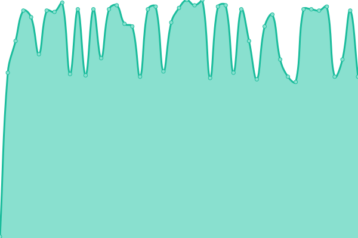
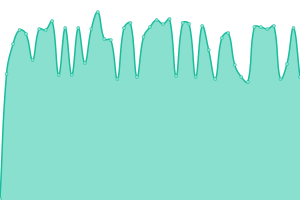
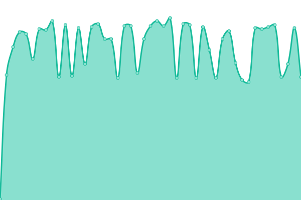
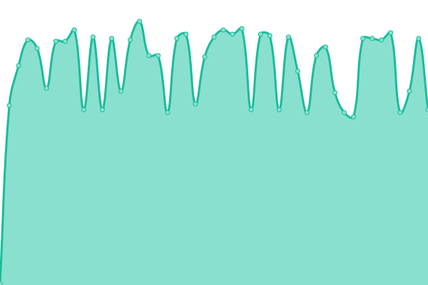
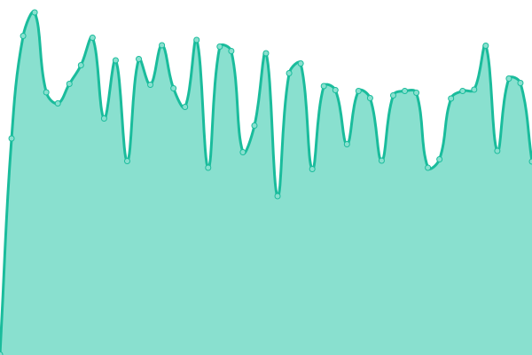
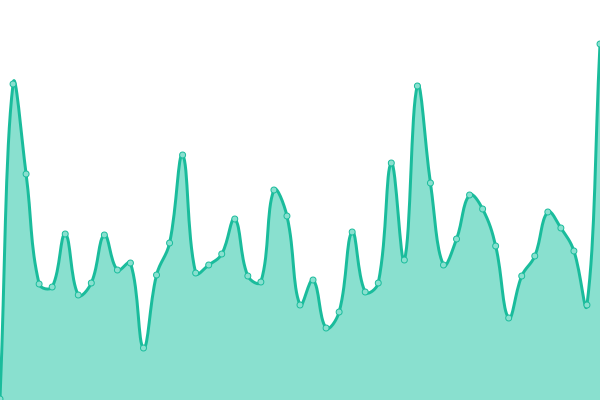
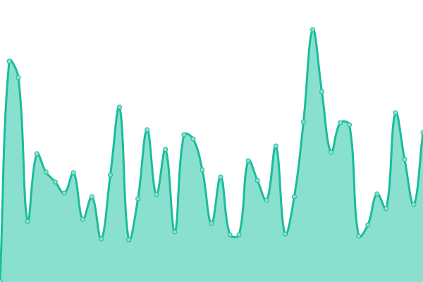

# [📈 Live Status](https://demo.upptime.js.org): <!--live status--> **すべてのシステムは正常に稼働**

This repository contains the open-source uptime monitor and status page for [Upptime](https://upptime.js.org), powered by [Upptime](https://github.com/upptime/upptime).

With [Upptime](https://upptime.js.org), you can get your own unlimited and free uptime monitor and status page, powered entirely by a GitHub repository. We use [Issues](https://github.com/upptime/upptime/issues) as incident reports, [Actions](https://github.com/TORO-Server/upptime/actions) as uptime monitors, and [Pages](https://demo.upptime.js.org) for the status page.

<!--start: status pages-->
<!-- This summary is generated by Upptime (https://github.com/upptime/upptime) -->
<!-- Do not edit this manually, your changes will be overwritten -->
<!-- prettier-ignore -->
| URL | 状態 | 履歴 | 応答時間 | 稼働時間 |
| --- | ------ | ------- | ------------- | ------ |
|  [TORO Minecraft Server](torosaba.net) | 正常 | [toro-minecraft-server.yml](https://github.com/TORO-Server/upptime/commits/HEAD/history/toro-minecraft-server.yml) | 

 154ミリ秒
     
 | 

<a href="https://status.torosaba.net/history/toro-minecraft-server">100.00%</a>
    

|  [TORO Minecraft Server (minuma)](minuma.torosaba.net) | 正常 | [toro-minecraft-server-minuma.yml](https://github.com/TORO-Server/upptime/commits/HEAD/history/toro-minecraft-server-minuma.yml) | 

 154ミリ秒
     
 | 

<a href="https://status.torosaba.net/history/toro-minecraft-server-minuma">100.00%</a>
    

|  [TORO Minecraft Server (lgb)](lgb.torosaba.net) | 正常 | [toro-minecraft-server-lgb.yml](https://github.com/TORO-Server/upptime/commits/HEAD/history/toro-minecraft-server-lgb.yml) | 

 154ミリ秒
     
 | 

<a href="https://status.torosaba.net/history/toro-minecraft-server-lgb">100.00%</a>
    

|  [TORO Minecraft Server (doro)](doro.torosaba.net) | 正常 | [toro-minecraft-server-doro.yml](https://github.com/TORO-Server/upptime/commits/HEAD/history/toro-minecraft-server-doro.yml) | 

 154ミリ秒
     
 | 

<a href="https://status.torosaba.net/history/toro-minecraft-server-doro">100.00%</a>
    

|  [TORO Minecraft Server (toto)](toto.torosaba.net) | 正常 | [toro-minecraft-server-toto.yml](https://github.com/TORO-Server/upptime/commits/HEAD/history/toro-minecraft-server-toto.yml) | 

 154ミリ秒
     
 | 

<a href="https://status.torosaba.net/history/toro-minecraft-server-toto">100.00%</a>
    

|  [TORO Dynmap](https://map.torosaba.net/) | 正常 | [toro-dynmap.yml](https://github.com/TORO-Server/upptime/commits/HEAD/history/toro-dynmap.yml) | 

 615ミリ秒
     
 | 

<a href="https://status.torosaba.net/history/toro-dynmap">98.55%</a>
    

|  [TORO Pass API](https://pass-api.torosaba.net/) | 正常 | [toro-pass-api.yml](https://github.com/TORO-Server/upptime/commits/HEAD/history/toro-pass-api.yml) | 

 574ミリ秒
     
 | 

<a href="https://status.torosaba.net/history/toro-pass-api">98.55%</a>
    

|  [TORO Sound](https://sound.torosaba.net/) | 正常 | [toro-sound.yml](https://github.com/TORO-Server/upptime/commits/HEAD/history/toro-sound.yml) | 

 156ミリ秒
     
 | 

<a href="https://status.torosaba.net/history/toro-sound">100.00%</a>
    

|  [TORO Status Page](https://status.torosaba.net/) | 正常 | [toro-status-page.yml](https://github.com/TORO-Server/upptime/commits/HEAD/history/toro-status-page.yml) | 

 166ミリ秒
     
 | 

<a href="https://status.torosaba.net/history/toro-status-page">100.00%</a>
    

<!--end: status pages-->

[**Visit our status website →**](https://demo.upptime.js.org)

## 📄 License

- Powered by: [Upptime](https://github.com/upptime/upptime)
- Code: [MIT](./LICENSE) © [Anand Chowdhary](https://anandchowdhary.com), supported by [Pabio](https://pabio.com)
- Data in the `./history` directory: [Open Database License](https://opendatacommons.org/licenses/odbl/1-0/)
